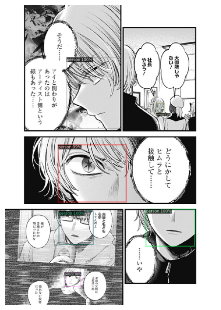
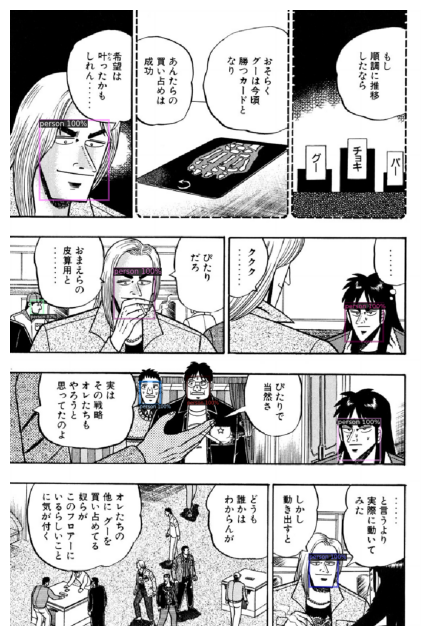

# Manga Character Extraction Model

This repository contains a model that extracts manga character images from manga pages. It leverages state-of-the-art object detection frameworks to accurately detect and crop character regions from full-page manga scans.

## Performance Metrics

The model has been evaluated on our test dataset and achieved the following metrics:

- **Precision:** 0.8489
- **Recall:** 0.9140
- **F-score:** 0.8803
- **Average Precision (AP):** 0.8488

## Demo

Below are some examples of the detection results:

